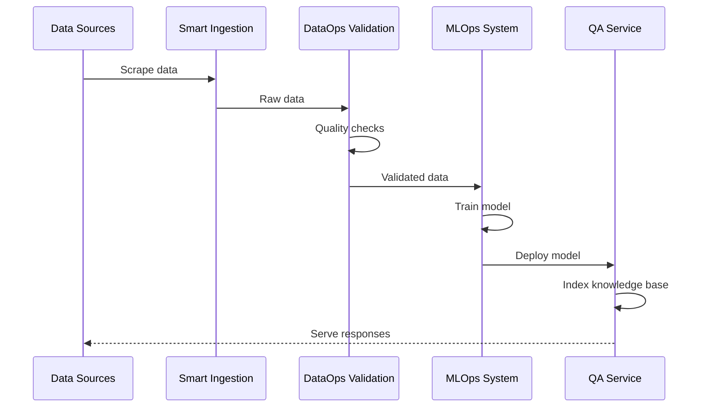

# Architecture Overview

## System Architecture

This document provides a comprehensive overview of the portfolio's architectural design, covering all four projects and their interactions.

---

## 🏗️ High-Level Architecture

### Layered Architecture

```
┌─────────────────────────────────────────────────────────────────┐
│                        PRESENTATION LAYER                        │
│  (APIs, Web Interfaces, Dashboards, Monitoring UIs)            │
└─────────────────────────────────────────────────────────────────┘
                              │
┌─────────────────────────────────────────────────────────────────┐
│                        APPLICATION LAYER                         │
│  (Business Logic, Service Orchestration, Workflow Management)   │
└─────────────────────────────────────────────────────────────────┘
                              │
┌─────────────────────────────────────────────────────────────────┐
│                         DATA LAYER                               │
│  (Data Validation, Processing, Feature Engineering, Storage)    │
└─────────────────────────────────────────────────────────────────┘
                              │
┌─────────────────────────────────────────────────────────────────┐
│                      INFRASTRUCTURE LAYER                        │
│  (Docker, Kubernetes, Cloud Services, CI/CD Pipelines)          │
└─────────────────────────────────────────────────────────────────┘
```

---

## 📦 Project Architecture

### 1. DataOps Validation Pipeline

**Purpose:** Ensures data quality through automated validation, normalization, and versioning.

#### Components

```
┌─────────────┐     ┌─────────────┐     ┌─────────────┐
│   Raw Data  │────▶│  Validator  │────▶│  Normalized │
│   Ingestion │     │  (Great     │     │    Data     │
└─────────────┘     │ Expectations)│     └─────────────┘
                    └─────────────┘            │
                           │                   │
                           ▼                   ▼
                    ┌─────────────┐     ┌─────────────┐
                    │   Quality   │     │     DVC     │
                    │   Reports   │     │  Versioning │
                    └─────────────┘     └─────────────┘
```

#### Key Design Patterns
- **Pipeline Pattern**: Sequential data processing stages
- **Validation Pattern**: Schema-based validation with Great Expectations
- **Version Control**: Git-like versioning for datasets

#### Technology Stack
- **Validation**: Great Expectations, Pandera
- **Storage**: DVC (Git-based data versioning)
- **Orchestration**: DVC pipelines
- **Containerization**: Docker

---

### 2. Smart Data Ingestion

**Purpose:** Automated collection and preprocessing of data from various sources.

#### Components

```
┌─────────────┐     ┌─────────────┐     ┌─────────────┐
│   Scraper   │────▶│  Extractor  │────▶│   Chunker   │
│  (Static/   │     │  (HTML      │     │  (Text      │
│  Dynamic)   │     │  Parsing)   │     │  Splitting) │
└─────────────┘     └─────────────┘     └─────────────┘
                                               │
                                               ▼
                                        ┌─────────────┐
                                        │  Schema     │
                                        │  Validator  │
                                        └─────────────┘
                                               │
                                               ▼
                                        ┌─────────────┐
                                        │  Processed  │
                                        │  Dataset    │
                                        └─────────────┘
```

#### Key Design Patterns
- **Strategy Pattern**: Multiple scraping strategies (static/dynamic)
- **Factory Pattern**: URL handler factory for different sources
- **Observer Pattern**: Progress tracking and logging

#### Technology Stack
- **Scraping**: BeautifulSoup, Playwright
- **Language Detection**: langdetect
- **Validation**: Pandera schemas
- **Storage**: JSONL format

---

### 3. MLOps Deployment System

**Purpose:** Complete MLOps lifecycle from training to deployment with monitoring.

#### Components

```
┌─────────────┐     ┌─────────────┐     ┌─────────────┐
│   Training  │────▶│    Model    │────▶│ Deployment  │
│   Pipeline  │     │   Registry  │     │  (K8s)      │
└─────────────┘     │  (MLflow)   │     └─────────────┘
                    └─────────────┘            │
                           │                   │
                           ▼                   ▼
                    ┌─────────────┐     ┌─────────────┐
                    │    Drift    │     │ Monitoring  │
                    │  Detection  │     │(Prometheus) │
                    └─────────────┘     └─────────────┘
                                               │
                                               ▼
                                        ┌─────────────┐
                                        │  Alerting & │
                                        │  Retraining │
                                        └─────────────┘
```

#### Key Design Patterns
- **Microservices**: Independent, scalable services
- **Circuit Breaker**: Fault tolerance in API calls
- **Canary Deployment**: Gradual rollout strategy
- **Observer Pattern**: Monitoring and alerting

#### Technology Stack
- **API**: FastAPI
- **Deployment**: Kubernetes, Docker
- **Monitoring**: Prometheus, Grafana
- **Experiment Tracking**: MLflow, Weights & Biases
- **Orchestration**: Prefect

---

### 4. Enterprise QA Service

**Purpose:** Production-ready Q&A system with semantic search and source citation.

#### Components

```
┌─────────────┐     ┌─────────────┐     ┌─────────────┐
│   Query     │────▶│  Embedding  │────▶│   Vector    │
│   Input     │     │  Generation │     │   Search    │
└─────────────┘     └─────────────┘     │  (FAISS)    │
                                        └─────────────┘
                                               │
                                               ▼
                                        ┌─────────────┐
                                        │  Reranking  │
                                        │  & Scoring  │
                                        └─────────────┘
                                               │
                                               ▼
                                        ┌─────────────┐
                                        │  Response   │
                                        │ Generation  │
                                        └─────────────┘
```

#### Key Design Patterns
- **Repository Pattern**: Data access abstraction
- **Cache Aside**: Redis caching for performance
- **Decorator Pattern**: Request/response middleware
- **Adapter Pattern**: Multiple embedding model support

#### Technology Stack
- **Search**: FAISS, Sentence Transformers
- **API**: FastAPI
- **Caching**: Redis
- **Storage**: PostgreSQL (future), JSONL (current)

---

## 🔄 Integration Architecture

### Data Flow



### Inter-Project Communication

1. **Data Handoff**: JSONL files with standardized schema
2. **API Integration**: REST APIs with OpenAPI specs
3. **Event-Driven**: Message queues for async operations (future)
4. **Shared Storage**: DVC-managed artifacts

---

## 🛡️ Security Architecture

### Security Layers

```
┌─────────────────────────────────────────────────────────┐
│  1. Network Security (TLS, VPN, Firewalls)              │
└─────────────────────────────────────────────────────────┘
┌─────────────────────────────────────────────────────────┐
│  2. Authentication (JWT, OAuth2)                        │
└─────────────────────────────────────────────────────────┘
┌─────────────────────────────────────────────────────────┐
│  3. Authorization (RBAC, API Keys)                      │
└─────────────────────────────────────────────────────────┘
┌─────────────────────────────────────────────────────────┐
│  4. Data Protection (Encryption at rest/transit)        │
└─────────────────────────────────────────────────────────┘
┌─────────────────────────────────────────────────────────┐
│  5. Audit Logging (Request tracking, Change logs)       │
└─────────────────────────────────────────────────────────┘
```

### Security Best Practices Implemented

- ✅ **No hardcoded secrets**: Environment variables only
- ✅ **PII sanitization**: Automated scrubbing of sensitive data
- ✅ **Input validation**: Schema-based validation at all entry points
- ✅ **Rate limiting**: API throttling to prevent abuse
- ✅ **Dependency scanning**: Regular vulnerability checks
- ✅ **Least privilege**: Minimal container permissions

---

## 📊 Monitoring & Observability

### Three Pillars of Observability

#### 1. Metrics (Prometheus)
- Request rate, latency, error rate (RED metrics)
- Resource utilization (CPU, memory, disk)
- Model performance (accuracy, drift)

#### 2. Logs (Structured Logging)
- Application logs (JSON format)
- Access logs (Nginx/API gateway)
- Audit logs (data access, model changes)

#### 3. Traces (Distributed Tracing)
- Request flow across services
- Performance bottleneck identification
- Dependency mapping

### Monitoring Stack

```
┌─────────────┐     ┌─────────────┐     ┌─────────────┐
│  Services   │────▶│ Prometheus  │────▶│   Grafana   │
│  (Metrics)  │     │  (Storage)  │     │ (Dashboard) │
└─────────────┘     └─────────────┘     └─────────────┘
                           │
                           ▼
                    ┌─────────────┐
                    │ Alertmanager│
                    │  (Alerts)   │
                    └─────────────┘
```

---

## 🚀 Deployment Architecture

### Kubernetes Architecture

```
┌─────────────────────────────────────────────────────────┐
│                    Ingress Controller                    │
│              (Load Balancer + TLS Termination)          │
└─────────────────────────────────────────────────────────┘
                          │
        ┌─────────────────┼─────────────────┐
        │                 │                 │
┌───────▼───────┐ ┌──────▼──────┐ ┌───────▼───────┐
│   QA Service  │ │   MLOps API │ │   Monitoring  │
│   Deployment  │ │  Deployment │ │   Services    │
└───────────────┘ └─────────────┘ └───────────────┘
        │                 │                 │
        └─────────────────┼─────────────────┘
                          │
                ┌─────────▼─────────┐
                │  Persistent Volume │
                │  (Models, Data)    │
                └────────────────────┘
```

### Deployment Strategies

1. **Blue-Green Deployment**
   - Zero-downtime deployments
   - Instant rollback capability
   - Used for major version changes

2. **Canary Deployment**
   - Gradual traffic shifting (5% → 50% → 100%)
   - Real-time monitoring during rollout
   - Automatic rollback on errors

3. **Rolling Updates**
   - Pod-by-pod replacement
   - Continuous availability
   - Used for minor updates

---

## 📈 Scalability Considerations

### Horizontal Scaling

- **Stateless Services**: Easy to replicate (API servers)
- **Load Balancing**: Nginx/Kubernetes ingress
- **Auto-scaling**: HPA (Horizontal Pod Autoscaler)

### Vertical Scaling

- **Resource Limits**: CPU/memory quotas per service
- **Database Optimization**: Query optimization, indexing
- **Caching**: Redis for frequently accessed data

### Performance Optimization

1. **Vectorized Operations**: NumPy/Pandas for data processing
2. **Async I/O**: FastAPI for concurrent request handling
3. **Connection Pooling**: Database connection reuse
4. **Batch Processing**: Group operations for efficiency
5. **Model Optimization**: Quantization, ONNX runtime

---

## 🔄 CI/CD Architecture

### Pipeline Stages

```
┌─────────────┐     ┌─────────────┐     ┌─────────────┐
│    Commit   │────▶│    Build    │────▶│     Test    │
│  (Trigger)  │     │  (Docker)   │     │  (Pytest)   │
└─────────────┘     └─────────────┘     └─────────────┘
                                               │
                                               ▼
                                        ┌─────────────┐
                                        │   Security  │
                                        │    Scan     │
                                        └─────────────┘
                                               │
                                               ▼
                                        ┌─────────────┐
                                        │   Deploy    │
                                        │  (Staging)  │
                                        └─────────────┘
                                               │
                                               ▼
                                        ┌─────────────┐
                                        │  Approval   │
                                        │  (Manual)   │
                                        └─────────────┘
                                               │
                                               ▼
                                        ┌─────────────┐
                                        │   Deploy    │
                                        │(Production) │
                                        └─────────────┘
```

### Automated Checks

- ✅ Code linting (Ruff)
- ✅ Type checking (mypy)
- ✅ Unit tests (pytest)
- ✅ Integration tests
- ✅ Security scanning (Trivy)
- ✅ Container image scan
- ✅ Dependency vulnerabilities

---

## 🎯 Future Architecture Enhancements

### Short-term (3-6 months)
- [ ] Event-driven architecture with Kafka
- [ ] Feature store integration (Feast)
- [ ] Advanced A/B testing framework
- [ ] GraphQL API layer

### Medium-term (6-12 months)
- [ ] Multi-region deployment
- [ ] Service mesh (Istio)
- [ ] Model explainability dashboard
- [ ] Cost optimization automation

### Long-term (12+ months)
- [ ] Edge deployment support
- [ ] Real-time streaming ML
- [ ] Federated learning capabilities
- [ ] Auto-ML pipeline generation

---

## 📚 References

- [The Twelve-Factor App](https://12factor.net/)
- [Microservices Patterns](https://microservices.io/patterns/index.html)
- [Google SRE Book](https://sre.google/sre-book/table-of-contents/)
- [MLOps Principles](https://ml-ops.org/content/mlops-principles)
- [Kubernetes Best Practices](https://kubernetes.io/docs/concepts/configuration/overview/)

---

**Document Version:** 1.0  
**Last Updated:** 2024-01-15  
**Maintained By:** Portfolio Team
