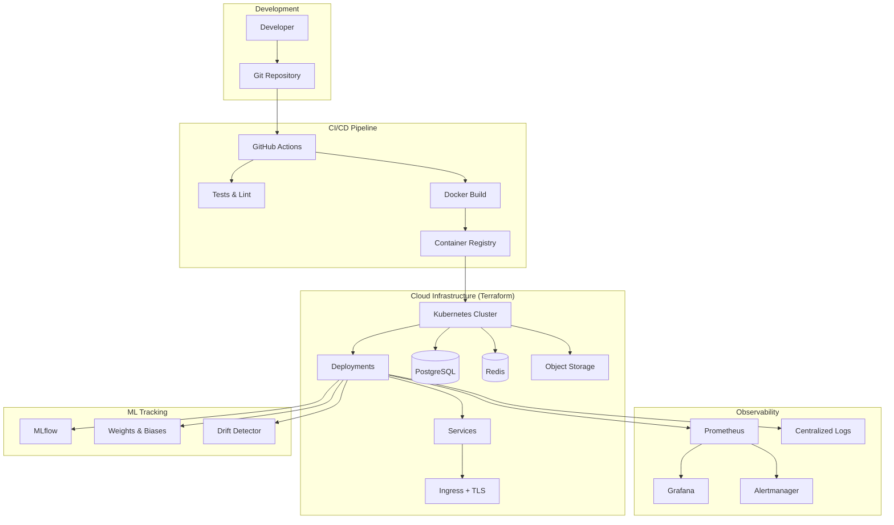

# 🤖 MLOps Deployment System

[](https://www.python.org/downloads/)
[](./tests)
[](./tests)
[](https://opensource.org/licenses/MIT)

> **Production-Grade MLOps System**  
> Complete ML pipeline with automated training, deployment, monitoring, and infrastructure-as-code.

Enterprise-level MLOps system demonstrating best practices in model lifecycle management, continuous integration/deployment, observability, and cloud-native infrastructure.

## 🎯 Key Features

### 🧪 **Testing & Quality (90%+ Coverage)**
- ✅ Comprehensive unit and integration tests
- ✅ Test fixtures with mocking for external dependencies
- ✅ Coverage reports and quality gates
- ✅ Automated testing in CI/CD pipeline

### ☸️ **Kubernetes Production-Grade**
- ✅ Multi-version deployments (blue-green, canary)
- ✅ Horizontal Pod Autoscaling (HPA) with custom metrics
- ✅ Network policies for zero-trust security
- ✅ ServiceMonitor with 20+ Prometheus alerting rules
- ✅ Ingress with TLS, rate limiting, and traffic splitting

### 🏗️ **Infrastructure as Code (Terraform)**
- ✅ Multi-cloud support (AWS EKS + GCP GKE)
- ✅ Managed databases (RDS, Cloud SQL)
- ✅ Caching layers (ElastiCache, Memorystore)
- ✅ Object storage (S3, GCS) with lifecycle policies
- ✅ IAM roles and security groups

### 📊 **Observability**
- ✅ Prometheus metrics and custom exporters
- ✅ Structured logging (JSON format)
- ✅ Distributed tracing ready
- ✅ Real-time alerting (Slack, GitHub Issues)

### 🚀 **MLOps Best Practices**
- ✅ Experiment tracking (MLflow, Weights & Biases)
- ✅ Model versioning and artifact management
- ✅ Data drift detection with embeddings
- ✅ Automated retraining pipelines
- ✅ Model performance monitoring

## 🏗️ System Architecture



## 📊 Technology Stack

| Category | Technologies |
|----------|-------------|
| **Language** | Python 3.10+ |
| **ML Framework** | Scikit-learn, sentence-transformers |
| **API** | FastAPI, Uvicorn, Gunicorn |
| **Testing** | Pytest, unittest.mock, coverage |
| **Containerization** | Docker (multi-stage builds) |
| **Orchestration** | Kubernetes, Helm |
| **IaC** | Terraform (AWS + GCP) |
| **CI/CD** | GitHub Actions |
| **Monitoring** | Prometheus, Grafana |
| **Experiment Tracking** | MLflow, Weights & Biases |
| **Databases** | PostgreSQL, Redis |
| **Storage** | S3, Google Cloud Storage |
| **Code Quality** | Ruff, MyPy, Bandit, pre-commit |

## 📁 Project Structure

```
mlops-deployment-system/
├── .github/workflows/
│   └── mlops-deployment-ci.yml    # Complete CI/CD pipeline
├── k8s/                            # Kubernetes manifests
│   ├── deployment.yaml            # Multi-version deployments
│   ├── hpa.yaml                   # Horizontal Pod Autoscaler
│   ├── configmap.yaml             # Configuration + Prometheus alerts
│   ├── secrets.template.yaml      # Secret templates
│   ├── ingress.yaml               # Ingress with TLS + canary
│   ├── networkpolicy.yaml         # Zero-trust networking
│   ├── servicemonitor.yaml        # Prometheus + 20+ alerts
│   ├── pvc.yaml                   # Persistent volumes
│   └── README.md                  # K8s deployment guide
├── terraform/                      # Infrastructure as Code
│   ├── aws/                       # AWS EKS + RDS + S3
│   │   ├── main.tf
│   │   ├── variables.tf
│   │   ├── outputs.tf
│   │   └── terraform.tfvars.example
│   ├── gcp/                       # GCP GKE + Cloud SQL + GCS
│   │   ├── main.tf
│   │   ├── variables.tf
│   │   ├── outputs.tf
│   │   └── terraform.tfvars.example
│   └── README.md                  # Terraform deployment guide
├── tests/                          # Comprehensive test suite
│   ├── test_train.py              # Training pipeline tests (600+ lines)
│   ├── test_drift_detector.py     # Drift detection tests (400+ lines)
│   ├── test_app.py                # API endpoint tests
│   └── conftest.py                # Shared fixtures
├── space/
│   └── app.py                     # FastAPI application
├── train.py                        # Production ML training pipeline
├── drift_detector.py               # Data drift detection
├── Dockerfile                      # Multi-stage Docker build
├── requirements.txt                # Pinned dependencies
├── pytest.ini                      # Test configuration
└── README.md                       # This file
```

## 🚀 Quick Start

### Prerequisites

- **Python 3.10+**
- **Docker** (for containerization)
- **kubectl** (for Kubernetes deployment)
- **Terraform** (for infrastructure provisioning)
- **Git**

### Local Development

```bash
# Clone repository
git clone https://github.com/youruser/Portfolio.git
cd Portfolio/mlops-deployment-system

# Create virtual environment
python -m venv .venv
source .venv/bin/activate  # Linux/Mac
.venv\Scripts\activate     # Windows

# Install dependencies
pip install -r requirements.txt

# Run tests
pytest tests/ -v --cov=. --cov-report=html

# Train model locally
python train.py --max_steps 100 --output artifacts/

# Start API server
uvicorn space.app:app --host 0.0.0.0 --port 8080 --reload
```

### Docker Deployment

```bash
# Build image
docker build -t mlops-deployment:latest .

# Run container
docker run -p 8080:8080 \
  -e MODEL_PATH=/app/artifacts/model.joblib \
  mlops-deployment:latest

# Test endpoints
curl http://localhost:8080/health
curl http://localhost:8080/metrics
```
## 🧪 Testing (90%+ Coverage)

### Running Tests

```bash
# Run all tests with coverage
pytest tests/ -v --cov=. --cov-report=html --cov-report=term

# Run specific test files
pytest tests/test_train.py -v
pytest tests/test_drift_detector.py -v
pytest tests/test_app.py -v

# Run tests with markers
pytest -m "unit" -v
pytest -m "integration" -v

# Generate coverage report
coverage html
open htmlcov/index.html  # View coverage report
```

### Test Structure

- **`test_train.py`** (600+ lines): Comprehensive training pipeline tests
  - Configuration validation
  - Data generation and preprocessing
  - Model training and evaluation
  - Artifact saving and loading
  - MLflow/W&B experiment tracking
  - Error handling and edge cases

- **`test_drift_detector.py`** (400+ lines): Drift detection system tests
  - Baseline loading and creation
  - Embedding calculation
  - Drift score computation
  - Notification systems (Slack, GitHub)
  - Edge cases and error handling

- **`test_app.py`**: FastAPI endpoint tests
  - Health checks
  - Prediction endpoints
  - Metrics endpoints
  - Error responses

### Code Quality

```bash
# Run linting
ruff check .

# Run type checking
mypy train.py drift_detector.py

# Run security checks
bandit -r .

# Format code
ruff format .
```

## ☸️ Kubernetes Deployment

### Production Deployment

```bash
# Navigate to K8s directory
cd k8s/

# Create namespace
kubectl create namespace mlops

# Configure secrets (copy template first)
cp secrets.template.yaml secrets.yaml
# Edit secrets.yaml with actual credentials
kubectl apply -f secrets.yaml

# Deploy all manifests
kubectl apply -f configmap.yaml
kubectl apply -f pvc.yaml
kubectl apply -f deployment.yaml
kubectl apply -f hpa.yaml
kubectl apply -f networkpolicy.yaml
kubectl apply -f ingress.yaml
kubectl apply -f servicemonitor.yaml

# Verify deployment
kubectl get all -n mlops
kubectl get pods -n mlops -w
```

### Key Features

#### 1. Horizontal Pod Autoscaling
```bash
# HPA automatically scales based on:
# - CPU utilization (70% threshold)
# - Memory utilization (80% threshold)
# - Custom metrics (HTTP requests per second)

kubectl get hpa -n mlops
kubectl describe hpa mlops-deployment-hpa -n mlops
```

#### 2. Network Security (Zero-Trust)
```bash
# Network policies enforce:
# - Ingress only from nginx-ingress
# - Egress to specific services only
# - Pod-to-pod communication restricted

kubectl get networkpolicies -n mlops
```

#### 3. Canary Deployments
```bash
# Deploy canary version (10% traffic)
kubectl scale deployment qna-v2 -n mlops --replicas=1

# Monitor canary
kubectl logs -f deployment/qna-v2 -n mlops

# Promote to 50% traffic (edit ingress canary-weight)
kubectl apply -f ingress.yaml

# Full rollout
kubectl scale deployment qna-v2 -n mlops --replicas=3
kubectl scale deployment qna-v1 -n mlops --replicas=0
```

#### 4. Monitoring & Alerting
```bash
# View Prometheus metrics
kubectl port-forward svc/prometheus-operated 9090:9090 -n monitoring
# Open http://localhost:9090

# Check ServiceMonitor
kubectl get servicemonitor -n mlops
kubectl describe servicemonitor mlops-app-monitor -n mlops
```

### Troubleshooting

```bash
# Check pod status
kubectl get pods -n mlops

# View pod logs
kubectl logs -f deployment/qna-v1 -n mlops

# Describe pod for events
kubectl describe pod <pod-name> -n mlops

# Execute into pod
kubectl exec -it deployment/qna-v1 -n mlops -- /bin/bash

# Check resource usage
kubectl top pods -n mlops
kubectl top nodes
```

## 🏗️ Infrastructure as Code (Terraform)

### AWS Deployment

```bash
cd terraform/aws/

# Initialize Terraform
terraform init

# Copy and customize variables
cp terraform.tfvars.example terraform.tfvars
vim terraform.tfvars

# Plan infrastructure
terraform plan -out=tfplan

# Deploy infrastructure
terraform apply tfplan

# Get outputs
terraform output

# Configure kubectl
aws eks update-kubeconfig --region us-east-1 --name mlops-deployment-prod
```

**AWS Resources Created:**
- EKS Cluster (Multi-AZ with managed node groups)
- RDS PostgreSQL (with automated backups)
- ElastiCache Redis (cluster mode)
- S3 Buckets (models + data with lifecycle policies)
- VPC (3 AZs, NAT gateways, security groups)
- IAM Roles (IRSA for secure pod access)
- CloudWatch (logs and metrics)

### GCP Deployment

```bash
cd terraform/gcp/

# Initialize Terraform
terraform init

# Authenticate with GCP
gcloud auth application-default login
gcloud config set project YOUR_PROJECT_ID

# Copy and customize variables
cp terraform.tfvars.example terraform.tfvars
vim terraform.tfvars

# Plan infrastructure
terraform plan -out=tfplan

# Deploy infrastructure
terraform apply tfplan

# Get outputs
terraform output

# Configure kubectl
gcloud container clusters get-credentials mlops-deployment-prod --region us-central1
```

**GCP Resources Created:**
- GKE Cluster (Regional with autoscaling)
- Cloud SQL PostgreSQL (HA with PITR)
- Memorystore Redis (HA with persistence)
- Cloud Storage Buckets (models + data)
- VPC Network (with Cloud NAT)
- Workload Identity (for secure pod access)
- Cloud Monitoring (integrated)

### Infrastructure Management

```bash
# Update infrastructure
terraform plan
terraform apply

# View state
terraform show
terraform state list

# Destroy infrastructure (⚠️ CAUTION)
terraform destroy

# Cost estimation
terraform plan -out=tfplan
terraform show -json tfplan | infracost breakdown --path -
```

## 🔄 CI/CD Pipeline

The GitHub Actions workflow automatically runs on every push/PR:

### Pipeline Stages

1. **Code Quality**
   - Ruff linting
   - MyPy type checking
   - Bandit security scanning

2. **Security**
   - Dependency scanning (Safety)
   - Container scanning (Trivy)
   - Secret detection

3. **Testing**
   - Unit tests (pytest)
   - Integration tests
   - Coverage reporting (90%+ required)

4. **Build**
   - Multi-stage Docker build
   - Image optimization
   - Push to registry (GHCR)

5. **Deploy**
   - Staging deployment (automatic)
   - Production deployment (manual approval)
   - Smoke tests

### Secrets Configuration

Configure in GitHub repo settings:

```
WANDB_API_KEY: Weights & Biases API key
DOCKER_USERNAME: Docker registry username
DOCKER_PASSWORD: Docker registry token
AWS_ACCESS_KEY_ID: AWS credentials (for AWS deployment)
AWS_SECRET_ACCESS_KEY: AWS credentials
GCP_SERVICE_ACCOUNT_KEY: GCP service account (for GCP deployment)
SLACK_WEBHOOK: Slack notifications (optional)
```

## 📊 Monitoring & Observability

### Metrics

The API exposes Prometheus metrics at `/metrics`:

- `http_requests_total`: Total HTTP requests
- `http_request_duration_seconds`: Request latency
- `model_predictions_total`: Total predictions
- `model_drift_score`: Current drift score
- `model_accuracy`: Model performance metric

### Alerts

20+ pre-configured Prometheus alerts:

- High error rate (>5%)
- High latency (P95 > 1s)
- Model drift detected (score > 0.15)
- Pod restarts
- High memory/CPU usage
- Low throughput

### Dashboards

```bash
# Access Grafana
kubectl port-forward svc/grafana 3000:3000 -n monitoring

# Import dashboards:
# - Kubernetes Cluster Monitoring (ID: 7249)
# - Kubernetes Pod Monitoring (ID: 6417)
# - NGINX Ingress Controller (ID: 9614)
```

## 🔐 Security Best Practices

✅ **Secrets Management**: External secret managers (Vault, AWS Secrets Manager)  
✅ **Network Policies**: Zero-trust networking, least-privilege access  
✅ **RBAC**: Role-based access control for Kubernetes  
✅ **Container Security**: Non-root users, read-only filesystem  
✅ **TLS/SSL**: Encrypted communication (cert-manager)  
✅ **Vulnerability Scanning**: Automated scanning in CI/CD  
✅ **Audit Logging**: Comprehensive audit trails  

## 📚 Documentation

- **[Kubernetes Guide](./k8s/README.md)**: Detailed K8s deployment instructions
- **[Terraform Guide](./terraform/README.md)**: Infrastructure provisioning guide
- **[Architecture](../../docs/ARCHITECTURE.md)**: System architecture overview
- **[Security](../../docs/SECURITY.md)**: Security guidelines and best practices
- **[Costs](../../docs/COSTS.md)**: Cost analysis and optimization

## 🤝 Contributing

See [CONTRIBUTING.md](../../CONTRIBUTING.md) for guidelines.

## 📄 License

This project is licensed under the MIT License - see [LICENSE](LICENSE) file for details.

## 📞 Support

- **Issues**: [GitHub Issues](https://github.com/youruser/Portfolio/issues)
- **Discussions**: [GitHub Discussions](https://github.com/youruser/Portfolio/discussions)
- **Documentation**: [Main README](../../README.md)
